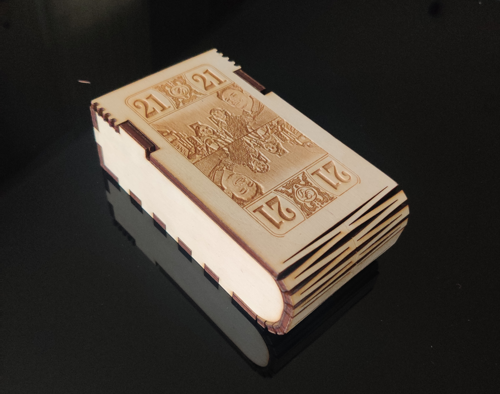
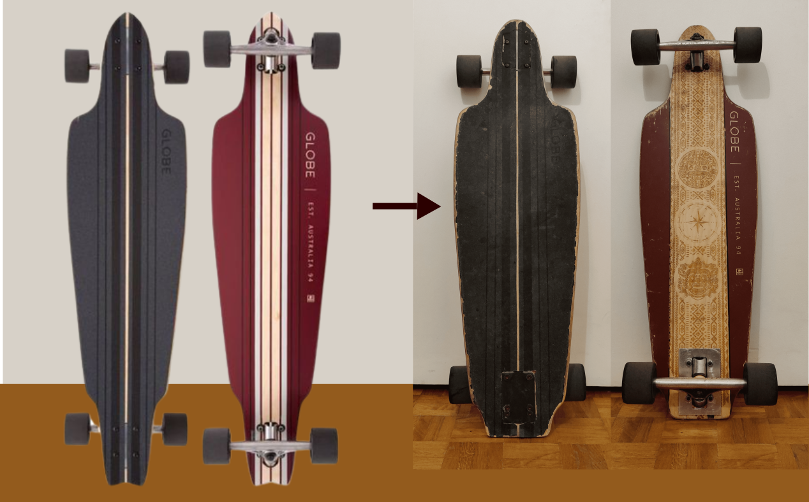
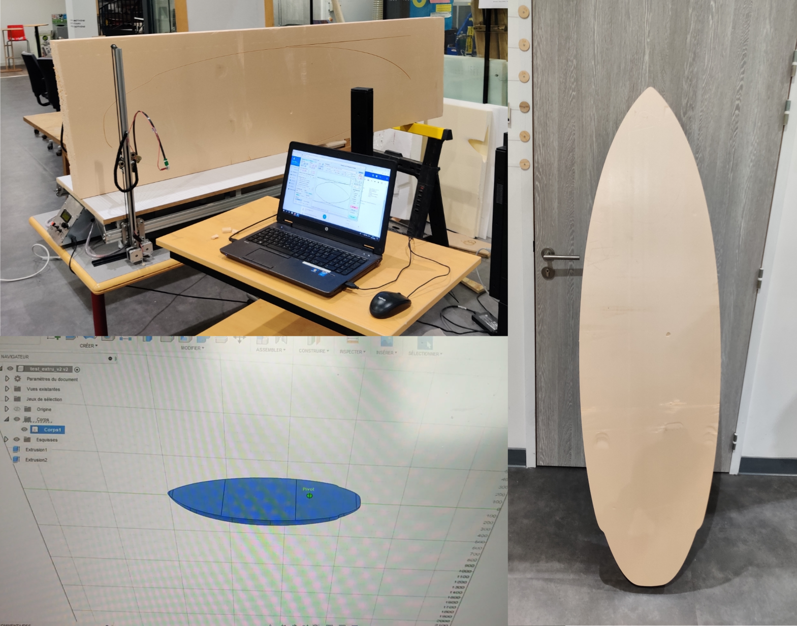

Le [Fablab](https://fablab-manager.isae.fr/) de SUPAERO met à disposition de nombreux outils dernier cri.
J'ai pu réaliser, pendant ma scolarité, quelques projets en utilisant ces outils. En voici une liste non exhaustive.

#  Découpeuse laser

La découpeuse laser du Fablab (Trotec) permet de travailler différents matériaux, notamment le bois qui a de très bonnes propriétés de gravure.
L'outil graphique utilisé pour les opérations est un fichier vectoriel *.svg* obtenu grâce au logiciel [Inkscape](https://inkscape.org/fr/)

### Fabrication d'une boîte à jeu de cartes

Premier projet de boîte flexible, c'est une boîte de jeu de tarot que l'on peut ouvrir et refermer à souhait.
La partie flexible de la boîte est donnée par le découpage en accordéon. 
Le plan de base de la boite a été généré sur [boxes.py](https://festi.info/boxes.py/)

{: .mx-auto.d-block :}

### Fabrication d'un jeu d'échecs chinois

Adèpte de ce jeu, j'ai dessiné un plateau et découpé ce dernier grâce à la découpeuse laser. 
Les pièces de jeu seront peintes en rouge/noir pour différencier les joueurs plus facilement.
Le bois utilisé est du contreplaqué 8mm pour le plateau et les pièces.

{: .mx-auto.d-block :}

### Réparation et gravure d'une longboard

Moyen de locomotion facilement transportable, je suis adepte du longboard pour me déplacer en ville.
Je possède cette planche "Globe Prowler" depuis maintenant 6 ans.
Après un accident, cette planche a été **cassée en deux** au niveau des roues arrière.
Mais ne pouvant m'en séparer, j'ai décidé de la réparer en utilisant la partie avant restante.
J'ai de plus poncé une partie du motif inférieur pour y graver mon propre dessin. 
Elle est aujourd'hui parfaitement fonctionnelle.

{: .mx-auto.d-block :}

# Découpeuse fil chaud

Notamment utilisée pour prototyper des projets aéronautiques, la découpeuse fil chaud asservie est l'outil idéal pour travailler les blocs de polyestère.
Mise à disposition très récemment aux élèves, elle necessite d'une formation de sécurité préalable (tout comme la découpeuse laser).

### Découpe d'un pain en mousse pour une planche de surf

Comme précisé dans le [Projet itinérance en vélo au Maroc](https://pierre-phu.github.io/2023-05-01-maroc/) j'ai voulu faire moi même ma planche de surf.
Pour ce faire, la première étape a été de prédécouper le pain de mousse (plaque d'isolant achetée dans un magasin de bricolage) à la forme d'une planche que j'ai dessinée.
Cette étape cruciale a déterminé la forme globale de ma planche avant de pouvoir faire les partie convexes et concaves de la planche (à la main).

{: .mx-auto.d-block :}

# Dremel

J'utilise l'outil multi-usage de [Dremel](https://www.dremel.com/fr/fr) avec des têtes permettant de poncer des matériaux avec une grande précision.
C'est un des seuls outils permettant de travailler le métal à l'InnovSpace.

### Confection d'une bague avec une pièce de 20 centimes

Mon objectif, cette fois-ci, était de commencer à travailler le métal.
Je me suis donc donné pour but de faire une bague avec une pièce de 20 centimes.
Le travail demandait à la fois patience et précision car le métal est bien plus difficile à travailler que le bois.
Après plusieurs échecs, j'ai enfin réussi à donner la forme que je souhaitais à la pièce.
La pierre (opale australienne) a été incrustée grâce à de la colle bi-composant.

{: .mx-auto.d-block :}

