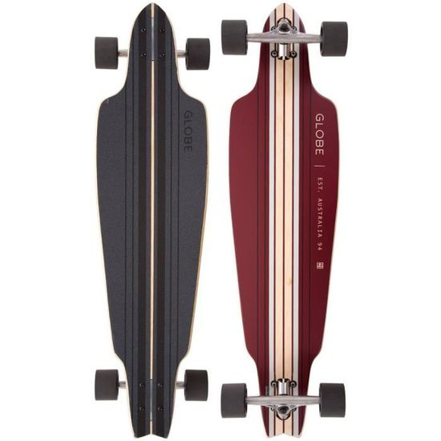
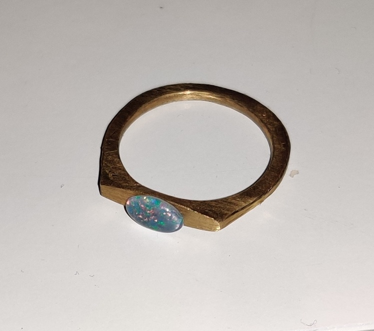

Le [Fablab](https://fablab-manager.isae.fr/) de SUPAERO met à disposition de nombreux outils dernier cri.
J'ai pu réaliser, pendant ma scolarité, quelques projets en utilisant ces outils. En voici une liste non exhaustive.

#  Découpeuse laser

La découpeuse laser du Fablab (Trotec) permet de travailler différents matériaux, notamment le bois qui a de très bonnes propriétés de gravure.
L'outil graphique utilisé pour les opérations est un fichier vectoriel *.svg* obtenu grâce au logiciel [Inkscape](https://inkscape.org/fr/)

### Réparation et gravure d'une longboard

Moyen de locomotion facilement transportable, je suis adepte du longboard pour me déplacer en ville.
Je possède cette planche "Globe Prowler" depuis maintenant 5 ans.

{: .mx-auto.d-block :}

Après un accident, cette planche a été cassée en deux au niveau des roues arrière.
Mais ne pouvant m'en séparer, j'ai décidé de la réparer en utilisant la partie avant restante.
J'ai de plus poncé une partie du motif inférieur pour y graver mon propre dessin. Elle est aujourd'hui parfaitement fonctionnelle.

{: .mx-auto.d-block :}

### Tableau d'un domaine viticole

Il est commun de faire des tableaux gravés à l'imprimante laser.
J'ai donc voulu confectionner un tableau personnalisé pour un ami travaillant dans le vin.
Ne possédant aucun plan et ne pouvant directement vectoriser une image, j'ai dessiné manuellement les contours du domaine en suivant une image satellite.
Puis après quelques ajouts (localisation, logo) j'ai obtenu le résultat suivant :

{: .mx-auto.d-block :}

# Dremel

J'utilise l'outil multi-usage de [Dremel](https://www.dremel.com/fr/fr) avec des têtes permettant de poncer des matériaux avec une grande précision.
C'est un des seuls outils permettant de travailler le métal à l'InnovSpace.

### Confection d'une bague avec une pièce de 20 centimes

Mon objectif, cette fois-ci, était de commencer à travailler le métal.
Je me suis donc donné pour but de faire une bague avec une pièce de 20 centimes.
Le travail demandait à la fois patience et précision car le métal est bien plus difficile à travailler que le bois.
Après plusieurs échecs, j'ai enfin réussi à donner la forme que je souhaitais à la pièce.
La pierre (opale australienne) a été incrustée grâce à de la colle bi composant.

{: .mx-auto.d-block :}

### Réparation planche de surf (en cours)

Après avoir endommagé ma planche sur un récif (deux ailerons plantés dans les rochers) je dois changer les boîtiers d'ailerons et remettre une couche de fibre de verre et de résine.
L'extraction des anciens boîtiers et le ponçage de l'ancienne couche de fibre de verre se fera avec le Dremel.

{: .mx-auto.d-block :}
