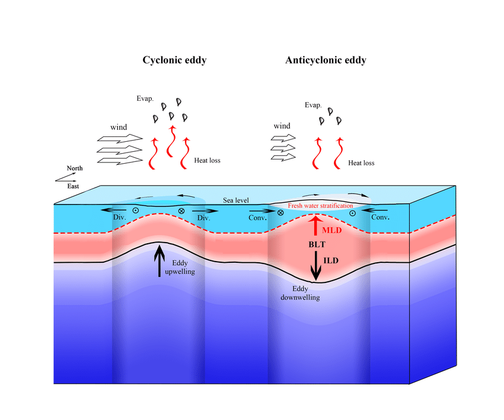
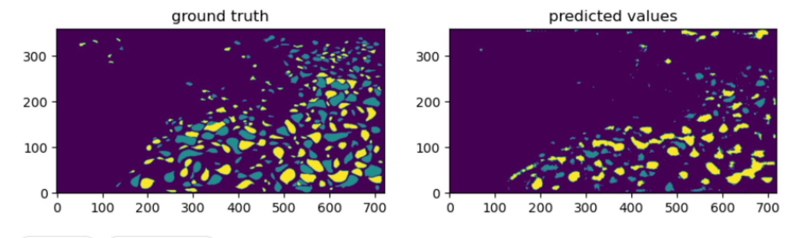

# Contexte et objectif du projet

Le projet proposé par [Mercator Ocean](https://www.kaggle.com/competitions/ocean-eddy-detection/overview) vise à combler le fossé entre la simulation de l'océan virtuel et la dynamique de l'océan réel en utilisant l'**IA pour détecter les tourbillons** dans la réalité virtuelle déformée, permettant ainsi une **meilleure validation des modèles océaniques** pour l'océanographie opérationnelle et diverses applications telles que la simulation de trajectoires de flotteurs.

L'objectif est de développer une approche de Deep Learning pour identifier les tourbillons océaniques en utilisant les données de température de surface de la mer (SST), d'anomalies du niveau de la mer (SLA) ainsi que des cartes de vitesse de l'océan. Cette recherche est nécessaire car les méthodes basées uniquement sur les SLA ont des limites. Le jeu de données comprend des "images" représentant ces variables et des labels montrant les contours des tourbillons (à identifier).

Ci-dessous, vous trouverez un schéma pouvant éclairer sur le **lien physique** entre les tourbillons et toutes les variables citées précédemment.
{: .mx-auto.d-block :}

# Approche et résultats

La première problématique à laquelle nous avons dû faire face a été de **gérer les données** (aberrantes, trop grande variance, NaN, etc.). 
De plus, pour le projet proposé, il fallait être capable de ne prédire aucun label sur la terre ferme, endroit qui n'avait pas de données non plus.
Afin d'avoir des résultats préliminaires intéressant, nous avons préféré travailler au début du projet sur une **sous partie de la carte demandée**. Cette sous partie étant située loins des côtes et necessitant peu de pré-traitement, elle nous a permis d'obtenir des **résultats rapidement** sur lesquels nous avons basés la suite de notre travail.

Nous avons utilisé la librairie **Xarray** pour la gestion de la donnée et nous avons répartis nos efforts en **deux équipes**. 
- La première équipe a eu une approche deep learning "classique" dans laquelle nous avons mis en place un entraînement d'**algorithme U-NET** (avec Pytorch). 
- La seconde équipe s'est attaché à développer une approche machine learning en utilisant des techniques de **Gradient Boosting** (LGBM) et en essayant d'ajouter des dépendances spatiales de manière artificielle en créant des variables de gradient.

Il s'est révélé que l'approche deep learning a été la plus fructueuse car peut être la plus facile à mettre en place dans le temps imparti. La précision de notre modèle U-NET (non pré-entrainé) était d'approximativement **0.7** pour les trois classes à déterminer (à savoir cyclone, anticyclone et sans cyclone)
En travaillant dans un groupe de 5 personnes pendant trois jours, nous avons obtenus les résultats suivants pour des prédictions sur la carte entière :

{: .mx-auto.d-block :}
